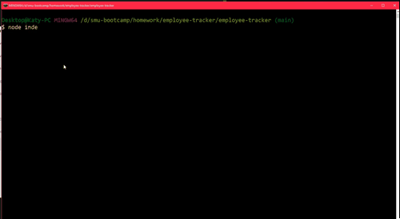

# Employee Tracker CLI Application 
 

## Table of Contents
* [Description](#description)
* [Technology Used](#technology)
* [Resources](#resources)
* [Licensing Information](#licensing)
* [GIF Demonstration](#GIF)
 

## Description
This is a project using Node.js, Inquirer NPM, cTable NPM and MySQL to create a command line application that allows a user to maintain a company employee database. A prerequisite to use this is having Node.js installed on the user's computer. The user can go [here](https://nodejs.org/en/) if they need to install node.js.  The user will also need to have MySQL installed as well. They can go [here](https://dev.mysql.com/doc/mysql-getting-started/en/) to download MySQL.  The user then navigates to the folder containing index.js within their terminal, then user can run the command *npm init -y* to install the package.json files. Then the user will need to run *npm install inquirer* to install inquirer. The user will also need to run *npm install mysql* to connect to the MySQL database. And finally, the user will need to run *npm install console.table* to be able to easily view database information neatly.

Once the installation is complete, the user can run the application by navigating to the root folder then running *node index.js* in their command terminal. They will then see a series of options that allows them to view and modify the company's employee database.

### Breakdown of what each selection does:
* *View all employees*
    * Shows all employees along with their department, title, salary, and manager.
* *View all departments*
    * Shows all the departments in the company
* *View all titles*
    * Shows all the titles in the company
* *View utilized budget by department
    * Shows the combined salaries for all employees of a department
* *Add an employee*
    * Adds an employee to the company
* *Add a title*
    * Adds a new employee title to the company
* *Add a department*
    * Adds a new department to the company
* *Remove an employee*
    * Removes an employee
* *Remove a title*
    * Removes an employee title from the company
* *Remove a department
    * Removes a department from the company
* *Update an employee's title*
    * Updates an employee's title
* *Update an employee's manager*
    * Updates the manager of an employee
* *Exit*
    * Exits the program

 

### [Video demonstration of application](https://klay824-note-taker.herokuapp.com/)

## Technology Used
* Node.js
* MySQL
* console.table NPM Package
* Inquirer NPM package
 

## Resources
* [console.table documenation](https://www.npmjs.com/package/console.table)
* [Inserting multiple rows](https://www.mysqltutorial.org/mysql-insert-multiple-rows/#:~:text=MySQL%20INSERT%20multiple%20rows%20statement&text=In%20this%20syntax%3A,data%20in%20the%20VALUES%20clause.)
* [SQL JOINS](https://www.w3schools.com/sql/sql_join.asp)
* [Concatenating multiple columns](https://makitweb.com/how-to-concatenate-multiple-columns-in-mysql/)
* [MySQL Delete](https://www.mysqltutorial.org/mysql-delete-statement.aspx)
* [MySQL Update](https://www.mysqltutorial.org/mysql-update-data.aspx)
* [MySQL SUM](https://www.mysqltutorial.org/mysql-sum/)
 

## Licensing Information
This project is covered under the MIT license.
 

## GIF

 
